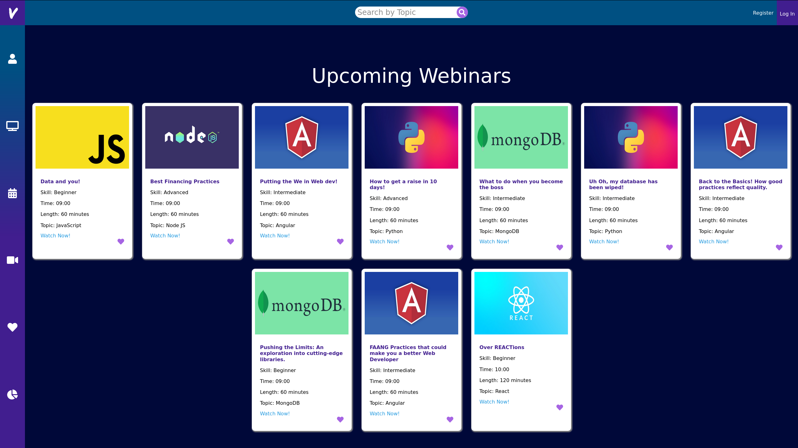

# Virtuoso



<br>

"Hear with your eyes." ~ Virtuoso

---

<br>

## Table of Contents

<br>

- [Description](#description)
- [Technologies](#technologies)
- [Get Started](#get-started)
- [Database](#database)
- [API](#api)
- [References](#references)
- [License](#License)
- [Author's Info](#author's-info)

<br>

[Back To Top](#Virtuoso)

<br>

## Description

<br>

Virtuoso is an aspiring online education platform built with a focus on improving the experience and efficacy of webinars as an educational forum.

We put our content creator (aka "Virtuoso") in the spotlight by making it easy for them to create, organize, and share their content in a way that fits their workflow and vision.

We enable our content consumer (aka "Prodigy") by making it easy for them to access and find the right content, without hassle. Out prodigies have the advantage being aided by our adaptive assessments, curated learning paths, courses authored by top industry experts, and on-demand usage statistics and reports.

Virtuoso is simply the stage. It's our community that makes for a symphony. [Hear with your eyes.](https://brokenhoax.github.io/Prodigy-Frontend/#/register)

<br>

## Technologies

<br>

- [M]ongoDb/Mongoose
- [E]xpress
- [R]eact
- [N]ode

<br>

[Back To Top](#Virtuoso)

<br>

## Get Started

<br>

### Test Credentials:

<br>

```
U/N: test@gmail.com
P/W: password
```

<br>

### To test the app hosted on Heroku:

<br>

https://brokenhoax.github.io/Prodigy-Frontend/#/

<br>

### To run the app locally:

<br>

<strong>Step 1</strong> - Clone both front-end and back-end repos:

- [Prodigy Frontend](https://github.com/brokenhoax/Prodigy-Frontend)

- [Prodigy Backend](https://github.com/brokenhoax/Prodigy-Backend)

<br>

<strong>Step 2</strong> - Install Virtuoso's dependencies by running the following command within the root directory of your <strong>front-end</strong> clone:

```javascript
npm install
```

<br>

<strong>Step 3</strong> - Install Virtuoso's dependencies by running the following command within the root directory of your <strong>back-end</strong> clone:

```javascript
npm install
```

<br>

<strong>Step 4</strong> - Run the following command within the root directory of your <strong>back-end</strong> clone:

```javascript
npm start
```

<br>

<strong>Step 5</strong> - Next, once the backend server is running, run the following command within the root directory of your <strong>front-end</strong> clone:

```javascript
npm start
```

<strong>Step 6</strong> - Navigate to your [Your Local Server](http://localhost:3000/Prodigy-Frontend#/) to test Virtuoso!

<br>

[Back To Top](#Virtuoso)

<br>

## Database:

<br>

### Webinar "Get All" Database:

https://frozen-woodland-47284.herokuapp.com/webinar/get/all

<br>

### User "Get All" Database:

https://frozen-woodland-47284.herokuapp.com/user/get/all

<br>

## API:

<br>

### Example API Query with Axios:

```javascript
const getAllWebinars = () => {
  axios
    .get("https://frozen-woodland-47284.herokuapp.com/webinar/get/all")
    .then((res) => {
      const results = res.data.data;
      setWebinars(results);
    })
    .catch((err) => {
      console.log(err);
    });
};
```

<br>

### Webinar Public Database Endpoints:

```
post("/webinar/create")
get("/webinar/get/id/:id")
get("/webinar/get/all")
get("/webinar/get/createdby/:id")
```

<br>

### User Public Database Endpoints:

```
post("/register")
post("/user/login")
get("/user/get/all")
get("/user/:id/webinar/favorite")
get("/user/:id/webinar/registered")
get("/user/:id/webinar/completed")
get("/user/:id/webinar/passed")
```

<br>

[Back To Top](#Virtuoso)

<br>

## References

<br>

[Built with React](https://reactjs.org/docs/getting-started.html)

[MERN JWT Authorization with Devistry](https://www.youtube.com/c/Devistry/featured)

[Styling Tips & Tricks with Kevin Powell](https://www.youtube.com/channel/UCJZv4d5rbIKd4QHMPkcABCw)

[State Crash Course with DevEd](https://www.youtube.com/c/DevEd/featured)

[Props and Context with WebDevSimplified](https://www.youtube.com/channel/UCFbNIlppjAuEX4znoulh0Cw)

[CSS Modules with CSS-Tricks](https://css-tricks.com/css-modules-part-3-react/)

[Schedule by Full Calendar](https://fullcalendar.io/)

[Charts with Chart.js](https://www.chartjs.org/)

<br>

[Back To Top](#Virtuoso)

<br>

## License

<br>

Released under MIT License

Copyright (c) 2020 | Matt McIvor

Copyright (c) 2020 | Juan Osorio

Copyright (c) 2020 | Andrew Kraus

Copyright (c) 2020 | John Sarmiento

Permission is hereby granted, free of charge, to any person obtaining a copy of this software and associated documentation files (the "Software"), to deal in the Software without restriction, including without limitation the rights to use, copy, modify, merge, publish, distribute, sublicense, and/or sell copies of the Software, and to permit persons to whom the Software is furnished to do so, subject to the following conditions:

The above copyright notice and this permission notice shall be included in all copies or substantial portions of the Software.

THE SOFTWARE IS PROVIDED "AS IS", WITHOUT WARRANTY OF ANY KIND, EXPRESS OR IMPLIED, INCLUDING BUT NOT LIMITED TO THE WARRANTIES OF MERCHANTABILITY, FITNESS FOR A PARTICULAR PURPOSE AND NONINFRINGEMENT. IN NO EVENT SHALL THE AUTHORS OR COPYRIGHT HOLDERS BE LIABLE FOR ANY CLAIM, DAMAGES OR OTHER LIABILITY, WHETHER IN AN ACTION OF CONTRACT, TORT OR OTHERWISE, ARISING FROM, OUT OF OR IN CONNECTION WITH THE SOFTWARE OR THE USE OR OTHER DEALINGS IN THE SOFTWARE.

<br>

[Back To Top](#Virtuoso)

<br>

## Author's Info

<br>

- GitHub - [brokenhoax](https://github.com/brokenhoax)
- GitHub - [AOKUME](https://github.com/AOKUME)
- GitHub - [juanwithouttheotter](https://github.com/juanwithouttheotter)
- GitHub - [MattTheGM](https://github.com/MattTheGM)

<br>

[Back To Top](#Virtuoso)
